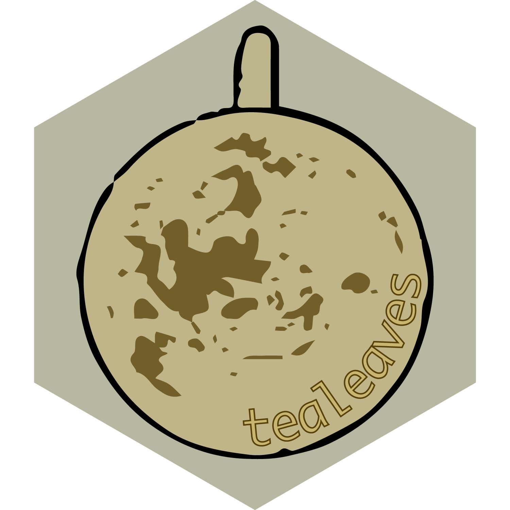
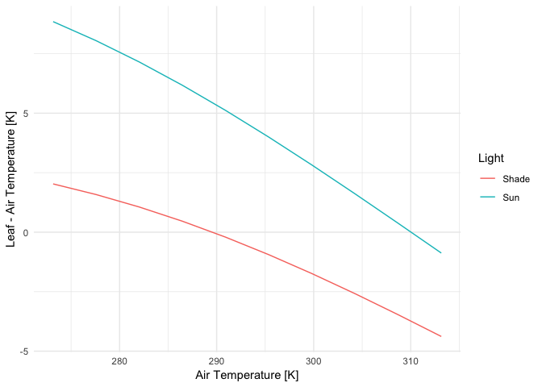

<!-- README.md is generated from README.Rmd. Please edit that file -->

# tealeaves 

<!-- badges: start -->

[](https://cran.r-project.org/package=tealeaves)
[](https://travis-ci.org/cdmuir/tealeaves)
[](https://www.tidyverse.org/lifecycle/#maturing)
<!-- badges: end -->

## Solve for leaf temperature using energy balance

## Description

{tealeaves} is a lightweight R package to model leaf temperature using
leaf energy balance. It uses the R package
[units](https://CRAN.R-project.org/package=units) to ensure that
parameters are properly specified and transformed before calculations.
It allows separate lower and upper surface conductances to heat and
water vapour, so sensible and latent heat loss are calculated for each
surface separately. It’s straightforward to model leaf temperature over
environmental gradients such as light, air temperature, humidity, and
wind, or trait gradients such as leaf size or stomatal conductance.

## Get tealeaves

<!--- From CRAN

```r
install.packages("tealeaves")
```

or from -->

GitHub

``` r
install.packages("devtools")
devtools::install_github("cdmuir/tealeaves")
```

And load tealeaves

``` r
library("tealeaves")
```

## Vignette

The {tealeaves} package solves for leaf temperature given a set of
environmental conditions and leaf traits by balancing the leaf energy
budget. There are two main steps to using {tealeaves}:

1.  define leaf parameters, environmental parameters, and physical
    constants; and
2.  solve for the a leaf temperature that balances its energy budget
    (`tleaf` and `tleaves` for single and multiple parameter sets,
    respectively).

In this vignette, I’ll show you how to:

  - run a minimum worked example using default parameters
  - replace default parameters
  - solve for leaf temperature along an environmental gradient

## Minimum worked example

You can use the default parameter settings and solve for leaf
temperature in a single leaf using the `make_*()` functions and
`tleaf()`.

``` r

library(magrittr)
library(tealeaves)

# Leaving the make_* functions empty will automatically default to defaults
# parameters.
leaf_par   <- make_leafpar()   # leaf parameters
enviro_par <- make_enviropar() # environmental parameters
constants  <- make_constants() # physical constants

T_leaf <- tleaf(leaf_par, enviro_par, constants, quiet = TRUE)

T_leaf %>% knitr::kable()
```

|        T\_leaf | value | convergence |             R\_abs |               S\_r |                  H |                  L |                        E |        Ar |       Gr |       Re |
| -------------: | ----: | ----------: | -----------------: | -----------------: | -----------------: | -----------------: | -----------------------: | --------: | -------: | -------: |
| 301.4181 \[K\] |     0 |           0 | 1363.813 \[W/m^2\] | 907.9499 \[W/m^2\] | 107.3552 \[W/m^2\] | 348.5078 \[W/m^2\] | 0.00794791 \[mol/m^2/s\] | 0.0048272 | 788182.4 | 12778.08 |

## Replace default parameters

You can look at default parameters settings in the manual (run
`?make_parameters`). These defaults are reasonable, but of course you
will probably want to use different choices and allow some parameters to
vary. Here, I’ll demonstrate how to replace a default. In the next
section, I’ll show you how to set up a gradient of parameter values over
which to solve for leaf temperature.

``` r

# Use the `replace` argument to replace defaults. This must be a named list, and
# each named element must have the proper units specified. See `?make_parameters`
# for all parameter names and proper units.

# First, we'll change stomatal conductance to 4 umol / (m^2 s Pa)
leaf_par <- make_leafpar(
  replace = list(
    g_sw = set_units(4, "umol/m^2/s/Pa")
    )
  )

# Next, we'll change the air temperature to 25 degree C (= 298.15 K)
enviro_par <- make_enviropar(
  replace = list(
    T_air = set_units(298.15, "K")
    )
  )

# Physical constants probably do not need to be replaced in most cases,
# that's why we call them 'constants'!
constants  <- make_constants()

T_leaf <- tleaf(leaf_par, enviro_par, constants, quiet = TRUE)

T_leaf %>% knitr::kable()
```

|        T\_leaf | value | convergence |             R\_abs |               S\_r |                  H |                  L |                         E |        Ar |       Gr |       Re |
| -------------: | ----: | ----------: | -----------------: | -----------------: | -----------------: | -----------------: | ------------------------: | --------: | -------: | -------: |
| 302.1106 \[K\] |     0 |           0 | 1363.813 \[W/m^2\] | 916.3234 \[W/m^2\] | 130.0263 \[W/m^2\] | 317.4631 \[W/m^2\] | 0.007244854 \[mol/m^2/s\] | 0.0055546 | 903289.3 | 12752.29 |

## Environmental gradients

In the previous two examples, I used the `tleaf` function to solve for a
single parameter set. In most cases, you’ll want to solve for many
parameter sets. The function `tleaves` generalizes `tleaf` and makes it
easy to solve for multiple parameter sets using the same argument
structure. All you need to do is specify multiple values for one or more
leaf or environmental parameters and `tleaves` uses the
`tidyr::crossing` function to fit all combinations\[1\].

``` r

# As before, use the `replace` argument to replace defaults, but this time we
# enter multiple values

# First, we'll change stomatal conductance to to 2 and 4 umol / (m^2 s Pa)
leaf_par  <- make_leafpar(
  replace = list(
    g_sw = set_units(c(2, 4), "umol/m^2/s/Pa")
    )
  )

# Next, we'll change the air temperature to 20 and 25 degree C (= 293.15 and 298.15 K)
enviro_par <- make_enviropar(
  replace = list(
    T_air = set_units(c(293.15, 298.15), "K")
    )
  )

constants  <- make_constants()

# Now there should be 4 combinations (high and low g_sw crossed with high and low T_air)
T_leaves <- tleaves(leaf_par, enviro_par, constants, progress = FALSE, 
                    quiet = TRUE, set_units = FALSE)

T_leaves %>% 
  dplyr::select(T_air, g_sw, T_leaf) %>%
  knitr::kable()
```

|       T\_air |               g\_sw |        T\_leaf |
| -----------: | ------------------: | -------------: |
| 293.15 \[K\] | 2 \[umol/m^2/Pa/s\] | 300.2217 \[K\] |
| 298.15 \[K\] | 2 \[umol/m^2/Pa/s\] | 304.2065 \[K\] |
| 293.15 \[K\] | 4 \[umol/m^2/Pa/s\] | 298.3474 \[K\] |
| 298.15 \[K\] | 4 \[umol/m^2/Pa/s\] | 302.1106 \[K\] |

## Parallel processing

It can take a little while to model many different parameter sets. If
you have multiple processors available, you can speed things up by
running simulations in parallel. In the `tealeaves` function, simply use
the `parallel = TRUE` argument to simulate in parallel. Here I’ll
provide an example looking at how leaf-to-air temperature differentials
change with air temperature.

``` r

# We'll use the `replace` argument to enter multiple air temperatures and two light levels

leaf_par  <- make_leafpar()

enviro_par <- make_enviropar(
  replace = list(
    S_sw = set_units(c(300, 1000), "W/m^2"),
    T_air = set_units(seq(273.15, 313.15, length.out = 10), "K")
    )
  )

constants  <- make_constants()

tl <- tleaves(leaf_par, enviro_par, constants, progress = FALSE, quiet = TRUE,
              parallel = TRUE)
tl$T_air %<>% drop_units() # for plotting
tl$T_leaf %<>% drop_units() # for plotting
tl %<>% dplyr::mutate(Light = dplyr::case_when(
 round(drop_units(S_sw), 0) == 300 ~ "Shade",
 round(drop_units(S_sw), 0) == 1000 ~ "Sun"
))

# Plot T_air versus T_leaf - T_air at different light levels
library(ggplot2)
ggplot(tl, aes(T_air, T_leaf - T_air, color = Light)) +
  geom_line() +
  xlab("Air Temperature [K]") +
  ylab("Leaf - Air Temperature [K]") +
  theme_minimal() +
  NULL
```



## Contributors

  - [Chris Muir](https://github.com/cdmuir)

## Comments and contributions

I welcome comments, criticisms, and especially contributions\! GitHub
issues are the preferred way to report bugs, ask questions, or request
new features. You can submit issues here:

<https://github.com/cdmuir/tealeaves/issues>

## Meta

  - Please [report any issues or
    bugs](https://github.com/cdmuir/tealeaves/issues).
  - License: MIT
    <!--- * Get citation information for `tealeaves` in R doing `citation(package = 'tealeaves')` -->
  - Please note that this project is released with a [Contributor Code
    of Conduct](CONDUCT.md). By participating in this project you agree
    to abide by its terms.

<!-- end list -->

1.  Since optimization is somewhat time-consuming, be careful about
    crossing too many combinations. Use `progress = TRUE` to show
    progress bar with estimated time remaining.
